<table align="center"><tr><td align="center" width="9999"><br>

# ESP8266 TELEGRAM ALEXA

*Jonathan Chrysostomo Cabral Bonette*
</td></tr></table>

As smart homes, também conhecidas como casas conectadas, viraram tendência nos últimos anos. Esse conceito de moradia envolve o uso da tecnologia para garantir mais conforto, segurança e praticidade aos moradores. Essa categoria de produtos inclui smart displays, fechaduras, câmeras de segurança e até mesmo lâmpadas. Os dispositivos são conectados à Internet e podem ser controlados à distância pelo celular, uma grande facilidade para os usuários. No caso das luminárias, por exemplo, essa característica ajuda até mesmo a economizar energia.

De acordo com informações do site Techaeris, quase 70% dos americanos imaginam que, em cerca de uma década, as smart home serão tão populares quanto smartphones. Além disso, mais de 80% dos compradores de imóveis dizem que casas inteligentes estão entre suas preferências para uma possível aquisição. Confira a seguir mais detalhes a respeito do conceito e conheça alguns dispositivos conectados que já estão disponíveis para comprar no Brasil.

<h2 align="center">Idealização do Projeto</h2>

A principal característica das casas conectadas é o uso massivo de tecnologia de ponta, mesmo em itens comuns como lâmpadas ou fechaduras. O emprego desses dispositivos tem como objetivo trazer maior comodidade, mesmo para tarefas simples como abrir a garagem ou apagar as luzes. A proposta desse projeto é mostrar como que simples ações podem ser automatizadas de formas bem diferentes das usuais.

Ao detectar o sol, sua janela se abre, o briefing diário liga e sua rotina começa, seu café começa a passar, você está pronto para seu dia, devidamente vestido para o dia, pois sua assistente virtual já falou se vai fazer chuva ou sol, se deve levar um guarda-chuva ou um óculos de sol, já sabe quais seus compromissos do dia e as principais notícias de seu interesse até o presente momento, tudo isso sem você fazer absolutamente nada (depois de ter que fazer tudo isso, é claro), e poder comandar e acompanhar sua casa quando estiver fora dela, será que tem gente por ali? Quantos graus está hoje? Acender ou ligar uma música ambiente — *ahh o futuro! Ou melhor, o presente!* — .

A ideia desse projeto foi retratar algumas dessas finalidades em um único lugar, o nosso celular. Usando um bot do Telegram, podemos comandar nossos eletrônicos, de qualquer lugar do mundo, via chat no Telegram, mandar comandos para acender a luz do quarto, ver a temperatura, a humidade, ligar uma televisão, uma câmera, etc.

********************************************************
<h2 align="center">Itens Utilizados (Hardware e Componentes)</h2>

  **Sensor de Luminosidade LDR 5mm**<br>
  Usado para detectar a luz do sol e acender o LED.<br>
  <p align="center">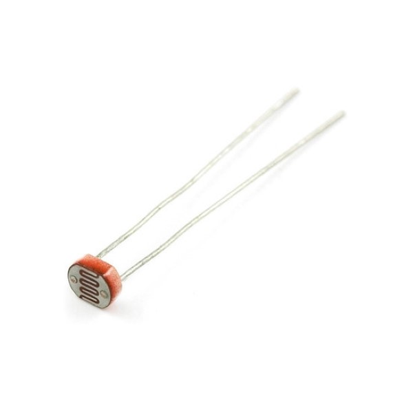<br></p>

  **Módulo Relé 5V 1 Canal**<br>
  Usado para ligar/desligar um determinado sensor/aparelho.
  <p align="center"><br></p>

  **Módulo WiFi ESP8266 NodeMcu ESP-12**<br>
  Necessário para se comunicar com o bot do Telegram e acionar dispositivos.
  <p align="center">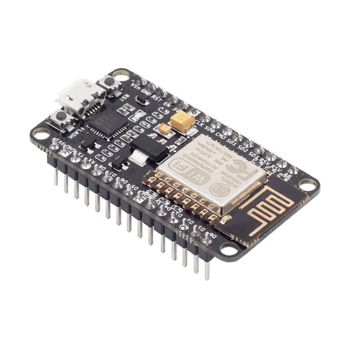<br></p>

  **Sensor de Umidade e Temperatura DHT11**<br>
  Necessário para medir temperatura e humidade do ar.
  <p align="center"><br></p>

  **LEDs 5mm**<br>
  Usados para representarem luzes de ambientes ou lâmpadas.
  <p align="center"><br></p>

  **Celular**<br>
  Usado para mandar os comandos ao sistema e se comunicar com a Alexa (para os que não possuem a assistente virtual da Amazon, Amazon Echo).
  <p align="center">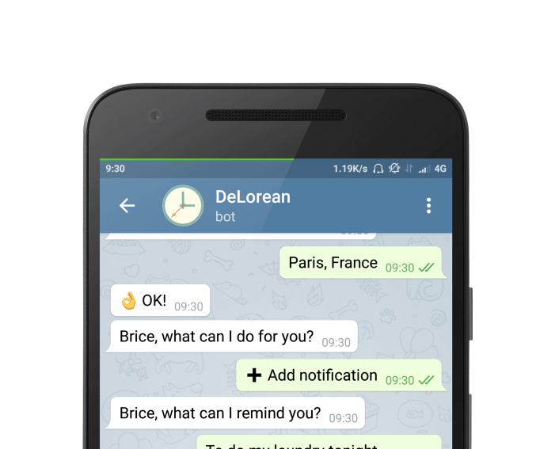<br></p><br>

  **Resistores**<br>
  Usados para o funcionamento adequado do circuito.
  <p align="center"><br></p>

  **Transistor**<br>
  Usado para o funcionamento adequado do circuito.
  <p align="center">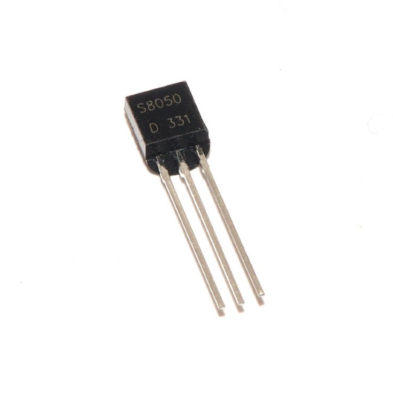<br></p>

  **Jumpers**<br>
  Usados para o funcionamento adequado do circuito.
  <p align="center"><br></p>

********************************************************
<h2 align="center">C: Conceito</h2>

O projeto se baseará em 2 partes ativas (que necessitam comandos de usuário) e 1 parte passiva (onde não é necessário atenção do usuário):

1. A integração celular <=> casa (Ativa)
2. A integração celular <=> assistente virtual (Ativa)
3. A instalação de uma luz com o módulo LDR (Passiva)

Apesar das duas primeiras partes não conversarem entre si no primeiro momento, seria possível se tivéssemos um equipamento especifico para isso, como por exemplo o dispositivo Amazon Echo.

Podemos no primeiro momento ter uma casa conectada e comandada via um Bot do Telegram, onde podemos enviar comandos e ter resultados daquilo, como por exemplo, ligar uma lâmpada, um ventilador, uma televisão, ter controles remotos como informações de temperatura e umidade (Vários outros módulos podem ser implementados através de ligações simples pelos relês ou mesmo no próprio módulo ESP, que permite mais de 9 conexões de controles simultâneas).

No segundo momento podemos ter acesso a uma assistente virtual, com comandos definidos por nós, como, quantos graus vai fazer hoje, quanto foi os jogos da rodada do meu campeonato preferido, meus compromissos do dia pelo meu calendário, programas preferidos, conversas pessoas, etc.

Em um terceiro momento com a aquisição de um dispositivo Echo, podemos fazer o Bot do Telegram e/ou sensores se comunicar diretamente pela assistente virtual no celular ou no próprio dispositivo (Não utilizado nesse projeto, porém é bom ressaltar a possibilidade).

Para a **parte 1**. foi desenvolvido ligações e esquemáticos e um bot no Telegram a fim de fazer conversarem entre si. Para a **parte 2**. foi desenvolvida uma rotina e uma integração com uma assistente virtual e programada para tais funções definidas. E por fim para a **parte passiva** foi instalado um módulo LDR e uma luz para que quando não tiver mais luminosidade do ambiente (escurecer o dia, fechar uma janela) ele identificará e acionará a luz (que pode ser uma luz de um quarto, um sistema de alarme, entre outras possibilidades).<br>

<p align="center"><br></p><br>

********************************************************
<h2 align="center">D: Design</h2>

A imagem do fritzing demonstra a construção na protoboard feita para este projeto, na qual mostra como foram feitas as ligações de cada módulo e quais as pinagens definidas que foram selecionados para o funcionamento do projeto.

<h3>Parte Eletrônica do Projeto</h3>
<p align="center"><br></p><br>

<h3>Fluxograma</h3>
<p align="center"><br></p><br>

<h3>Imagem</h3>
<p align="center">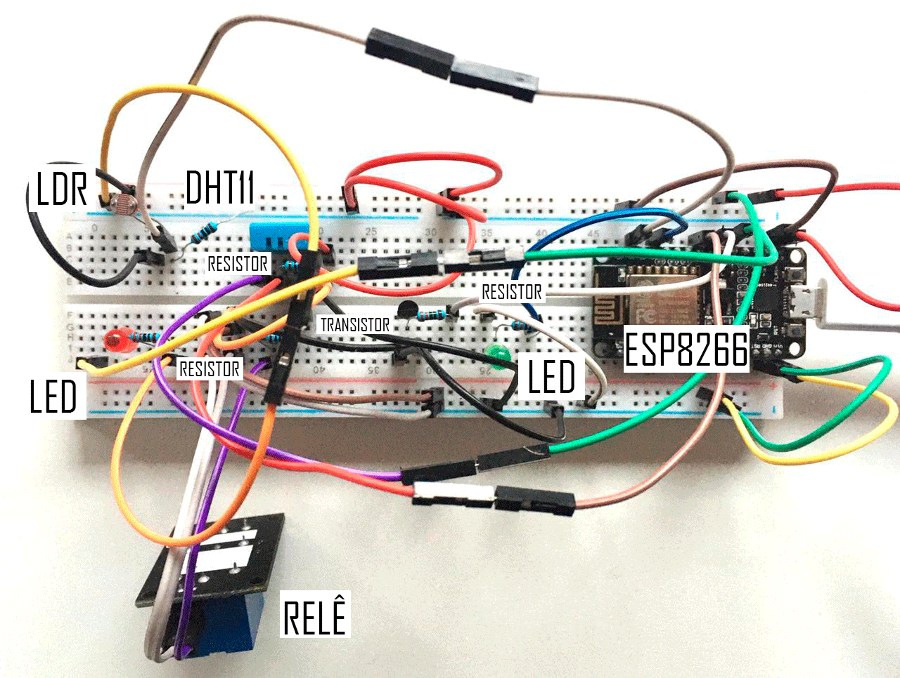<br></p><br>

********************************************************
<h2 align="center">I: Implementação</h2>

Um chatbot é um software que tenta simular uma conversa entre duas pessoas, interagindo com perguntas e respostas e com isso será possível neste caso controlar LEDs, Relês e fazer a leitura de sensores. Mas o campo é muito vasto, podemos criar alertas, como por exemplo, quando detectar algo na nossa casa, podemos receber diretamente no chat o que está ocorrendo, isso de qualquer lugar do mundo. Uma das ideias por trás da internet das coisas (IoT) é que tudo seja o mais fácil possível para nossos usuários, então usando um chatbot, basta você ter o aplicativo (Telegram) e conversar com seus dispositivos através de comandos pré definidos.

Por que o Telegram? O Telegram é um dos serviços que está crescendo muito ultimamente devido a vários fatores, inclusive as multifuncionalidades que o aplicativo oferece. É um aplicativo super intuitivo e fácil de configurar.

<h3>Criando um Bot no Telegram</h3>

- 1. Abrimos o Telegram e pesquisamos por @BotFather, selecionamos o com a marca azul (oficial seguro).<br>
<p align="center"><br></p><br>

- 2. Digitamos o comando /newbot para iniciar o processo de criação do bot.

- 3. Vai ser requisitado o nome do bot, então digitamos um nome.

- 4. Depois será requisitado o username do bot, que basicamente é a forma que você inicia a conversa com ele, iniciando um chat com o @username_do_seu_bot.

- 5. Depois disso o @BotFather vai devolver pra você um Token de acesso com o formato NNNNNNNNN:um-monte-de-letra-e-numero (Guarde o token gerado para substituir no código fonte .ino).<br>

<p align="center">
  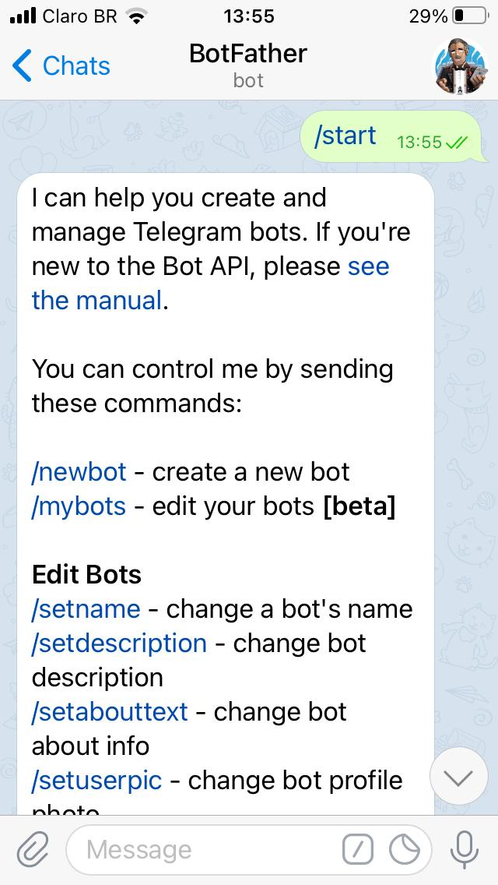 
  
  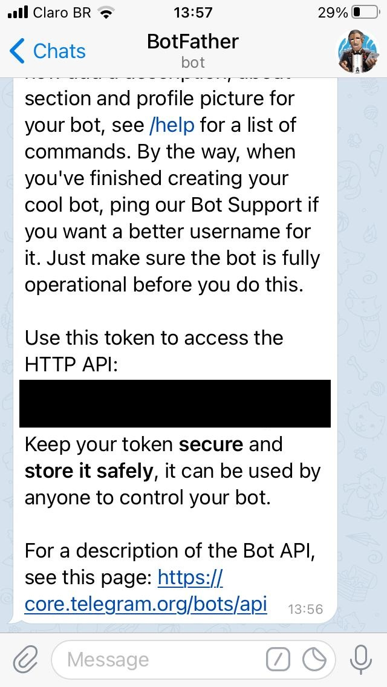
</p><br>

Com o bot criado e o Token em mão, já podemos começar os trabalhos no nosso microcontrolador.

**O esquema de ligação está detalhado em cima (Design).**

O uso do transistor para controlar o módulo de relê foi necessário pois o ESP8266 além de trabalhar com 3.3v, suas saídas digitais suportam apenas 12mA, então se um módulo precisar mais que isso, pode fazer o microcontrolador reiniciar sozinho e ter comportamentos estranhos.

<h3>Configurar a IDE do Arduino</h3>

- Atualizar o core do ESP8266 (Ferramentas->Placa->Gerenciar de Placas).
- Biblioteca ArduinoJson (Sketch->Incluir Biblioteca->Gerenciar Bibliotecas).
- Biblioteca UniversalTelegramBot (Sketch->Incluir Biblioteca->Gerenciar Bibliotecas).
- Biblioteca SimpleDHT (Sketch->Incluir Biblioteca->Gerenciar Bibliotecas).

<h3>Código</h3>

Basicamente o que o código esse faz é obedecer aos seguintes passos:

- Conecta na WiFi configurada — Método setupWifi.
- Configura os sensores e atuadores — Método setupPins.
- Fica em loop consultando por novas mensagens no Telegram.
- Ao receber novas mensagens, começa o tratamento de cada comando.

O projeto foi implementado através do código abaixo, que foi construído consultando diversos modos de funcionamento de cada módulo e adaptando-os ao objetivo deste projeto:

<h3>Declaração e variaveis</h3>

``` c++

#include <ESP8266WiFi.h>
#include <WiFiClientSecure.h>
#include <UniversalTelegramBot.h>
#include "DHT.h"

// Inicializa a conexão Wifi com o roteador
//Informações de login da rede
#define WIFI_SSID "sua_rede_aqui"
#define WIFI_PASSWORD "sua_senha_aqui"
//Token do bot
#define BOTtoken "000000000:XXXXXXXXXXXXXXXXXXXXXXXXXXXXXXXXXXX"  // Seu token do telegram

#define LED_PIN D3
#define RELAY_PIN D6
#define DHT_PIN D5
#define DHTTYPE DHT11
//Definição dos pinos do LDR e LED
const int LED_PIN_LDR = 15; //D8
const int LDR_PIN = 5; //D1

#define BOT_SCAN_MESSAGE_INTERVAL 1000 //Intervalo para obter novas mensagens (1000 ms = 1 s)
long lastTimeScan;  // Ultima vez que buscou mensagem
bool ledStatus = false; // Estado do LED
bool relayStatus = false; // Estado do Relê

```

<h3>Comandos e definições</h3>

``` c++

WiFiClientSecure client;
UniversalTelegramBot bot(BOTtoken, client);
DHT dht(DHT_PIN, DHTTYPE);
//Tempo em que foi feita a última checagem
uint32_t lastCheckTime = 0;

//Quantidade de usuários que podem interagir com o bot (Deixa o bot seguro)
#define SENDER_ID_COUNT 2 //Ids dos usuários que podem interagir com o bot. 
//É possível verificar seu id pelo monitor serial ao enviar uma mensagem para o bot
String validSenderIds[SENDER_ID_COUNT] = {"id_aqui", "id_aqui"};

```

<h3>Implementação com o Telegram (Input e Output)</h3>

``` c++

// Trata as novas mensagens que chegaram
void handleNewMessages(int numNewMessages) {
  Serial.println("Tratando novas Mensagens");
  Serial.println(String(numNewMessages));

  for (int i=0; i<numNewMessages; i++) {
    String chat_id = String(bot.messages[i].chat_id);
    String text = bot.messages[i].text;

    // Pessoa que está enviando a mensagem
    String from_name = bot.messages[i].from_name;    
    if (from_name == "") from_name = "Convidado";

    // Tratamento para cada tipo de comando a seguir.

    if (text == "/ledligado") {
      digitalWrite(LED_PIN, HIGH);   // liga o LED (HIGH é o nível da voltagem)
      ledStatus = true;
      bot.sendMessage(chat_id, "Led está ligado", "");
    }

    if (text == "/leddesligado") {
      ledStatus = false;
      digitalWrite(LED_PIN, LOW);    // desliga o LED (LOW é o nível da vontagem)
      bot.sendMessage(chat_id, "Led está desligado", "");
    }

    if (text == "/relayligado") {
      digitalWrite(RELAY_PIN, HIGH);
      relayStatus = true;
      bot.sendMessage(chat_id, "Relê está ligado", "");
    }

    if (text == "/relaydesligado") {
      relayStatus = false;
      digitalWrite(RELAY_PIN, LOW);
      bot.sendMessage(chat_id, "Relê está desligado", "");
    }

    if (text == "/status") {
      String message = "Led está ";
      if(ledStatus){
        message += "ligado";
      }else{
        message += "desligado";
      }
      message += ". \n";
      message += "Relê está ";
      if(relayStatus){
        message += "ligado";
      }else{
         message += "desligado";
      }
      message += ". \n";
      bot.sendMessage(chat_id, message, "Markdown");      
    }

    if( text == "/ambiente") {
      float humidity = dht.readHumidity();
      float temperature = dht.readTemperature();
      String message = "A temperatura é de " + String(temperature, 2) + " graus celsius.\n";
      message += "A umidade relativa do ar é de " + String(humidity, 2)+ "%.\n\n";      
      bot.sendMessage(chat_id, message, "Markdown");
    }

    // Cria teclado com as opções de comando
    if (text == "/opcoes") {
      String keyboardJson = "[[\"/ledligado\", \"/leddesligado\"],[\"/relayligado\", \"/relaydesligado\"],[\"/ambiente\",\"/status\"],[\"/opcoes\"]]";
      bot.sendMessageWithReplyKeyboard(chat_id, "Escolha uma das opções", "", keyboardJson, true);
    }
    
    // Comando de inicio de conversa no telegram
    if (text == "/start") {
      String welcome = from_name + ", bem vindo ao Bot do Projeto Integrador II.\n";
      welcome += "Para interagir com a casa, use um dos comandos a seguir.\n\n";
      welcome += "/ledligado : para ligar o Led \n";
      welcome += "/leddesligado : para desligar o Led \n";
      welcome += "/relayligado : para ligar o Relê \n";
      welcome += "/relaydesligado : para desligar o Relê \n";
      welcome += "/ambiente : saber a temperatura e umidade do ambiente \n";
      welcome += "/status : para saber o status dos sensores e atuadores \n";
      bot.sendMessage(chat_id, welcome, "Markdown");
    }
  }
}

```

<h3>Setup do Wifi</h3>

``` c++

void setupWifi(){  

  // Tentativa de conexão com o Wifi:
  Serial.print("Conectando o Wifi: ");
  Serial.println(WIFI_SSID);
  WiFi.begin(WIFI_SSID, WIFI_PASSWORD);

  while (WiFi.status() != WL_CONNECTED) {
    Serial.print(".");
    delay(500);
  }

  Serial.println("");
  Serial.println("WiFi conectado");
  Serial.print("Endereço de IP: ");
  Serial.println(WiFi.localIP());
}

```

<h3>Setup dos Pinos</h3>

``` c++

void setupPins(){
  pinMode(LED_PIN, OUTPUT); 
  pinMode(RELAY_PIN, OUTPUT); 
  delay(10);
  digitalWrite(LED_PIN, LOW); 
  digitalWrite(RELAY_PIN, LOW); 

  dht.begin();
}

```

<h3>Setup</h3>

``` c++

void setup() {
  pinMode(LED_PIN_LDR, OUTPUT);
  pinMode(LDR_PIN, INPUT);
  client.setInsecure();
  Serial.begin(115200); // Velocidade do monitor

  setupWifi();
  setupPins();

  lastTimeScan = millis();
}

```

<h3>Loop</h3>

``` c++

void loop() {
// Verificação do LDR (sensor passivo)
int ldrStatus = digitalRead(LDR_PIN);

  if (ldrStatus == 1) {

  digitalWrite(LED_PIN_LDR, LOW);
  //Serial.println("Sem presença de luz no LDR, LED está ligado"); // Mensagem enviada ao monitor (controle de funcionamento)
  //Serial.print(ldrStatus);

  }

  else {

  digitalWrite(LED_PIN_LDR, HIGH);
  //Serial.println("LED está desligado"); // Mensagem enviada ao monitor (controle de funcionamento)
  //Serial.println(ldrStatus);

  }
  // Bot do Telegram
  if (millis() > lastTimeScan + BOT_SCAN_MESSAGE_INTERVAL)  {
    Serial.print("Checando comandos - ");
    int numNewMessages = bot.getUpdates(bot.last_message_received + 1);  
    Serial.println(numNewMessages);
    while(numNewMessages) {
      Serial.println("Leitura de comando efetuada");
      handleNewMessages(numNewMessages);
      numNewMessages = bot.getUpdates(bot.last_message_received + 1);
    }

    lastTimeScan = millis();
  }
  yield();
  delay(10);
}

```

*O código do arduino está na pasta PROJETO FINAL aqui no Github, na pasta com meu nome. Se quiser você vai precisar trocar as seguintes variáveis para usar com o seu projeto de integração com o Telegram:<br>
BotToken: preencha com o Token obtido do @BotFather do seu bot criado.<br>
WIFI_SSID e WIFI_PASSWORD: você deve informar os dados para conectar na WiFi da sua casa.*

<h3>Configuração da Alexa</h3>

*No primeiro momento não conseguimos integrar diretamente a interação entre microcontrolador e assistente virtual, porém conforme comentado acima, essa funcionalidade pode ser implementada se tivermos o dispositivo Echo da Amazon.*

- 1. Baixar o aplicativo Amazon Alexa e criar uma conta.

- 2. Selecionamos a opção **mais** (Onde podemos adicionar o dispositivo Echo se tivermos).

- 3. Clicamos em **rotinas** e na opção **+** para criarmos uma nova rotina.

- 4. Podemos aqui definir o **nome da rotina**, o que queremos dizer para acionar a rotina e as ações desse acionamento (Ligar a TV, dizer os noticiários, etc.).

<p align="center">
   
  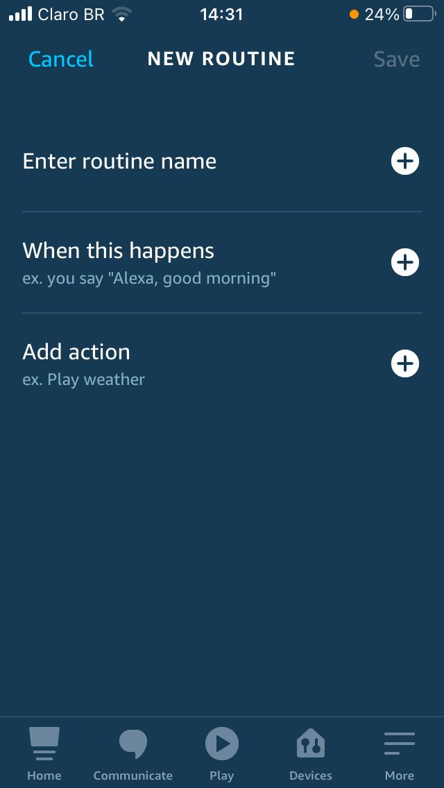
  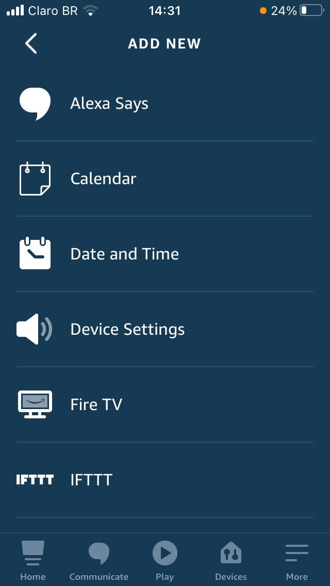
</p><br>

********************************************************
<h2 align="center">O: Operação</h2>

<h3>Interagindo com o Bot no Telegram</h3>

- 1. Vá até o BotFather e clique no link dado por ele para conversar com o bot ou procure pelo nome criado para conversar.

- 2. Clique em **START** ou **COMEÇAR**.

- 3. Receberemos uma mensagem de boas-vindas e os referentes comandos.

<p align="center">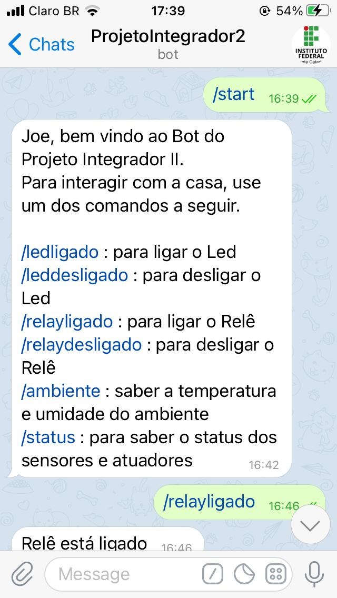<br></p>

- 4. Agora é só clicar nos comandos ou escreve-los no chat para ele responder com as características programadas.

Podemos ver que os comandos que foram solicitados responderam de acordo com o combinado.

<p align="center">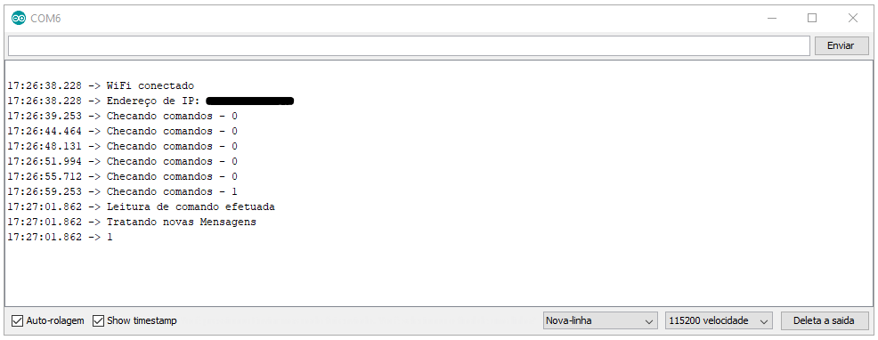<br></p>

<h3>Ligar e desligar os Relês</h3>

<p align="center"><br></p>

<p align="center">
  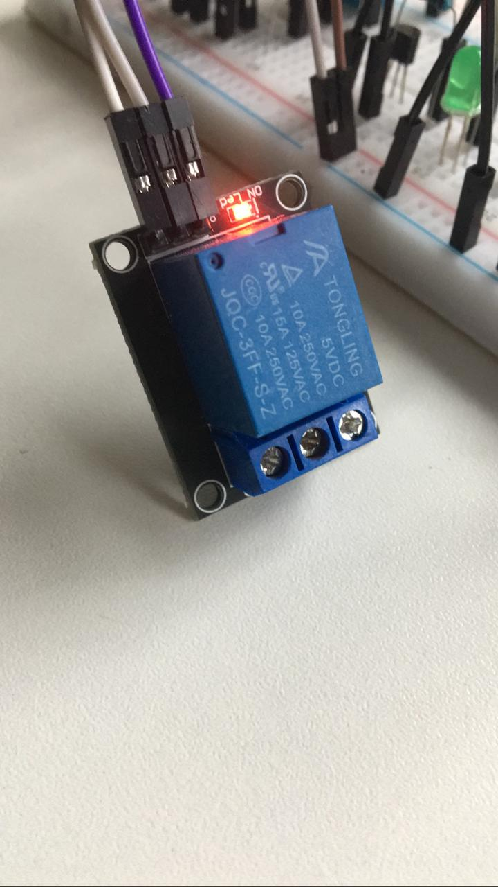
  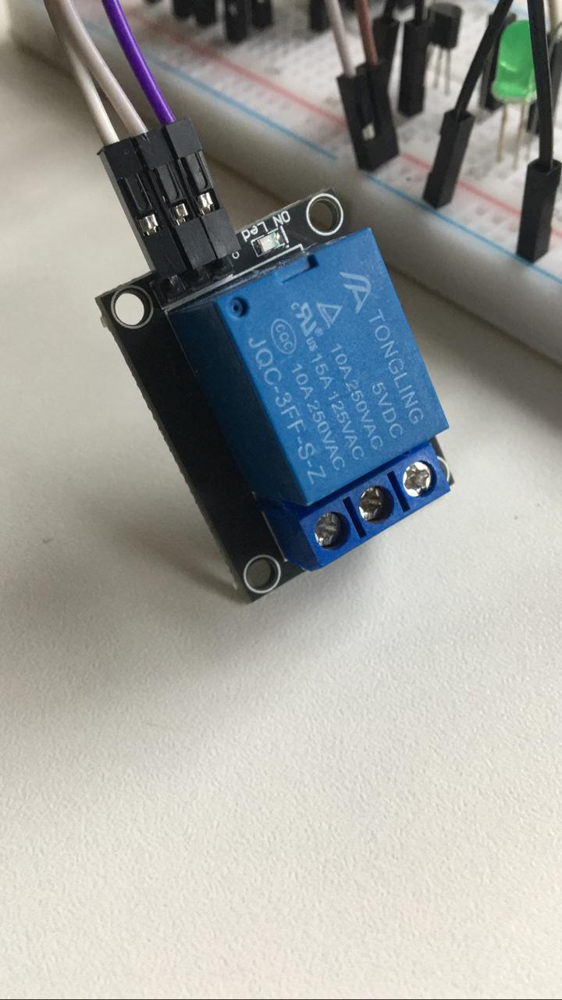
</p>

<h3>Ligar e desligar os LEDs e receber comandos de temperatura e umidade</h3>

<p align="center">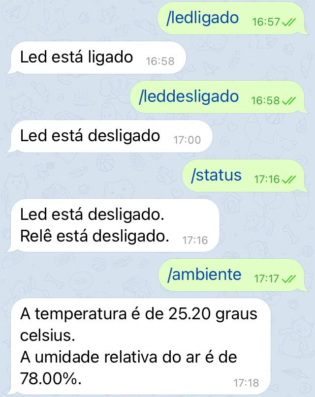<br></p>

<p align="center">
  
  
</p>

Vimos que o DHT11 funcionou corretamente vendo que o dia estava chuvoso e a temperatura não apresentava erros (de modo que o DHT11 estava dentro de um quarto e ele analisa o ambiente em torno do sensor).

<p align="center">
  
  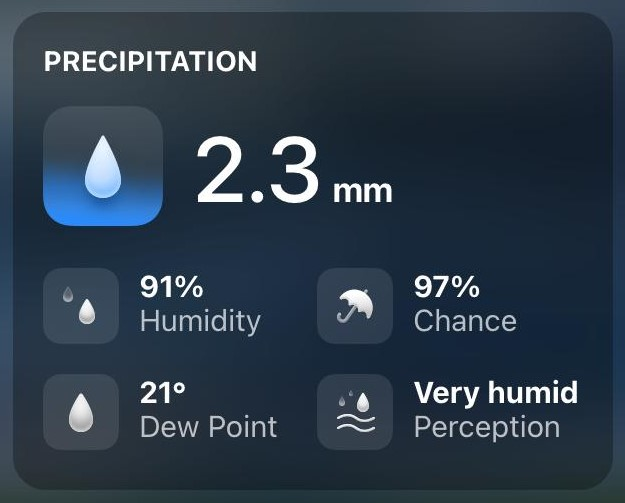
</p>

<h3>Ligar e desligar o LED do LDR</h3>

<p align="center"><br></p>

Podemos colocar o tratamento para cada comando que desejarmos, inclusive o Telegram tem suporte para enviar um teclado com os comandos pré-definidos por nós, como pode ser visto ao tratar o comando /opcoes. Os comandos criados foram:<br>
/start: Comando enviado ao iniciar o chat, mostra uma mensagem de boas-vindas e os comandos disponíveis.<br>
/ledligado e /leddesligado: Liga e desliga o LED.<br>
/relayligado e /relaydesligado: Liga e desliga o Relê.<br>
/ambiente : Consulta os dados do sensor de temperatura e umidade.<br>
/opcoes: Devolve um json com todos os comandos disponíveis.<br>
/status: Devolve o status atual do led e do relê.<br>

<p align="center"><br></p>

********************************************************
<h2 align="center">Resultados, Percepções Pessoais e Considerações Finais</h2>

Os resultados foram excelentes devido ao tempo e experiência na área pela minha pessoa, fiquei surpreso pela quantidade de possibilidades que podíamos ter e isso de certa forma até me deixou um pouco confuso, pois cada coisa que procurava na internet ficava mais entusiasmado de incluir mais um sensor, fazer uma coisa sempre a mais, dificultando as vezes o andamento do projeto.

Deixar o tema livre para o desenvolvimento do trabalho, me fez procurar bem mais a respeito dos sensores e aplicações, correr atrás e pensar em diversas soluções para o que havia proposto e no final do projeto, muito mais entusiasmo pela área.

Normalmente para controlar nossos dispositivos, ficamos limitados a rede WiFi local ou se quisermos acessar externamente, temos que fazer uma tediosa configuração com um serviço de DNS dinâmico (como o DuckDNS), liberar porta no modem, colocar ip estático e outras configurações que não cabem aqui descrever, para poder acessar de fora de casa.

As dificuldades encontradas por mim foi o uso pela primeira vez do arduino e dos sensores, descobrir como funciona a IDE do arduino, os sensores, suas pinagens, como usar e fazer conversarem entre si e apesar da faculdade prover todos os equipamentos, alguns equipamentos usados nesse projeto tiveram que ser comprados a parte como o ESP8266 e o módulo bluetooth (não utilizado nesse peojeto mas essencial para ver como que funciona a conectividade dos sensores com um celular) e elevaram um pouco o processo de aprendizagem assim como a dificuldade encontrada por querer também aplica em um Bot do Telegram que é um recurso totalmente novo para mim.

Outra dificuldade encontrada foi o não funcionamento da conectividade entre microcontroladores e o bot a versão 2.4.2 do ESP8266 aparentemente não funciona mais pelo fato de o Telegram ter atualizado e depois de uma vasta busca no Google e Fóruns descobriu-se que deveria usar a versão 2.5 pelo menos, atualizada com a linha de comado   **client.setInsecure();** no setup do código, sem isso é impossível validar a ID para controlar o microcontrolador.

Um problema que infelizmente acompanhou o projeto foi que conforme vamos adicionando bibliotecas e fazendo elas conversarem com o bot o bot se torna lento nas respostas, não possibilitando uma resposta imediata das leituras, porém as leituras são feitas instantaneamente (vendo do controle no monitor serial). O Telegram ainda não está 100% otimizado para fazer essas funções, porém vimos que a plataforma tem muito potencial futuro.

********************************************************
<h2 align="center">Melhorias</h2>

No primeiro momento existem várias melhorias que poderiam ser implementadas, luzes, sensores e/ou equipamentos que poderiam ser ligados diretamente no relê, e outros sensores diretamente na protoboard. Mas não para por aí, podemos até mesmo criar alertas, como por exemplo, quando detectar algo na nossa casa, podemos receber diretamente no chat o que está ocorrendo, isso de qualquer lugar do mundo. E a longo prazo poderíamos pensar grande, com tempo e conhecimento adequados, podemos explorar por exemplo a instalação de um sistema parecido para automatizar todos os setores de uma residência, portão, verificação de entrada, câmeras, sensores diversos, luzes, automatização de cômodos, entre outras funções.<br><br>

<p align="center">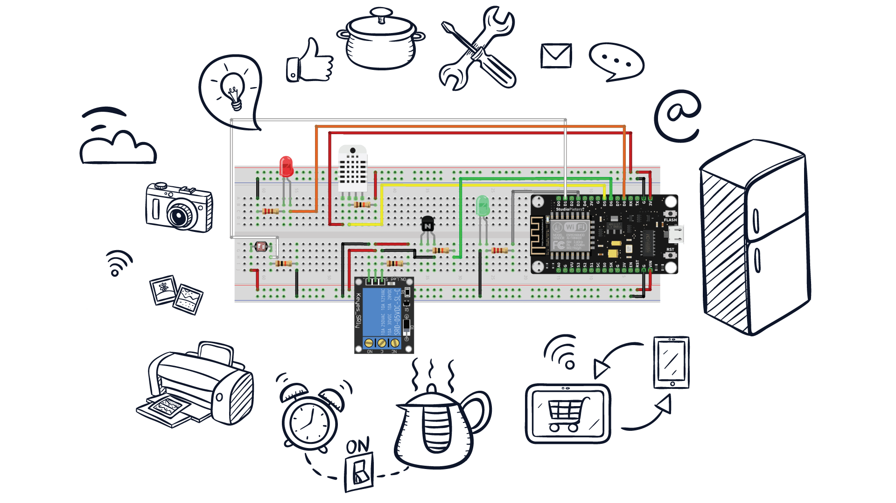<br></p><br>

********************************************************
<h2 align="center">Referências Bibliográficas</h2>

- https://medium.com/@alvaroviebrantz
- https://github.com/Gianbacchio/ESP8266-TelegramBot<br>
- https://create.arduino.cc/projecthub/Shubhamkumar97/home-automation-using-arduino-and-bluetooth-control-404e9c?ref=search&ref_id=ldr%20window&offset=6<br>
- https://www.hackster.io/FilippoOnesti/esp8266-clock-using-max7219-led-matrix-display-b036c7
